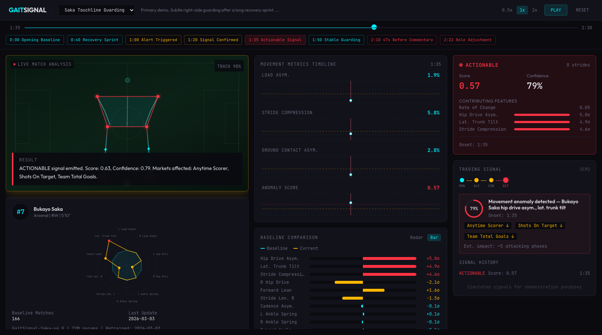
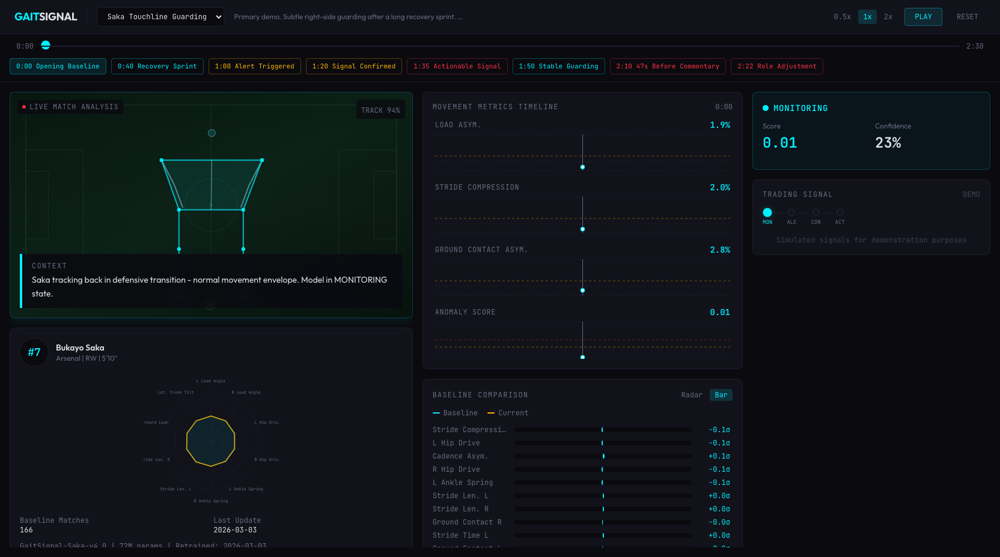
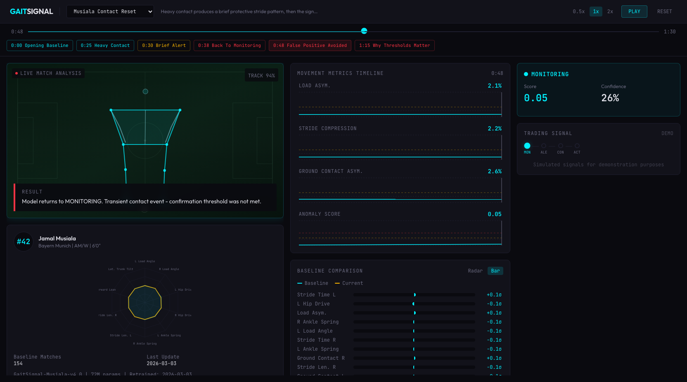

# GaitSignal

> Live football pricing-edge demo: use contracted in-stadium tracking plus player-specific movement surprise to surface in-play market information before standard pricing digestion catches up.

**Status: concept demo.** This repository is a synthetic React prototype. It does not train real player models or ingest live venue feeds. It shows what the workflow, evidence stack, and trading-desk surface could look like if bet365 had contracted low-latency access to in-stadium football tracking and synced event feeds.

This is the companion concept to [Acoustic Momentum](https://github.com/dmontgomery40/acoustic-momentum): one modality from the crowd, one modality from the player. The common theme is in-play information that the market may not fully price yet.



## Core Thesis

For a company like bet365, player and ball location should be treated as **venue-grade infrastructure**, not the differentiated idea. The differentiated layer is:

- one model per player
- player-specific movement surprise instead of universal thresholds
- football context gating so the same movement drift only matters when the role, phase, and market window make it commercially relevant

The question is not “can we rebuild commodity match state from scratch?” The question is “once venue state already exists, what extra live edge can we extract from how a player is moving?”

## What The Demo Shows

Each scenario generates:

- a synthetic 20-feature biomechanical vector
- a player-specific movement-surprise proxy
- a venue-style football context stream
- a computed pricing edge driven by movement surprise, context gate, source confidence, and market urgency

The UI is organized like a live desk:

- **Match-State / Venue Feed**: contracted tracking context, ball distance, phase of play
- **Player Motion Lens**: pose-style lower-body evidence for the selected player
- **Pricing Workflow Timeline**: movement surprise, context gate, edge score, source confidence
- **In-Play Pricing Edge**: warming, confirmed, and priceable states tied to market families

## Production Story

The production assumption is explicit:

- bet365 has access to contracted in-stadium optical tracking / pose-capable capture
- event/state feeds are synchronized at low latency
- the innovation budget goes above commodity tracking and into the player-specific layer

That player-specific layer would be:

1. Per-player temporal model
2. Prediction-surprise / gradient-delta style scoring
3. Context gate using possession, ball access, pitch zone, and role demand
4. Trading workflow that only opens when movement surprise and football context agree

This is not an injury diagnosis engine. It is a pricing-edge system for selected high-value players and market windows.

## Scenario Logic

### 1. Saka Recovery-Run Reprice

Movement drift begins during defensive recovery, but it is not priceable yet because Arsenal are still out of possession. The edge opens only when Saka becomes the immediate attacking outlet in a live transition / final-third phase.

| Baseline | Priceable |
| --- | --- |
|  |  |

### 2. Pedri Press-Decay Edge

Gradual fatigue only matters because Barcelona keep Pedri in the same high-demand pressing / recycling role. The market edge stays alive while the tactical demand stays alive.

### 3. Musiala Contact Reset

This is the anti-slop case. Even in a very hot attacking context, a transient contact spike clears before the workflow can confirm and price it.



## Why This Branch Exists

This branch intentionally moves away from “football as a reskinned basketball demo” and toward a football-native workflow:

- fixed in-stadium / contracted-data assumption
- no scripted state timeline overrides
- no hard-coded market impact from gait features alone
- no medical-style alert story as the primary product

The point is to show how a real, low-latency, contracted-data system could work in practice.

## Running The Demo

```bash
npm install
npm run dev
```

Then open the Vite app, choose a scenario, and scrub through the cue points to see how venue context changes the meaning of the same movement signal.
