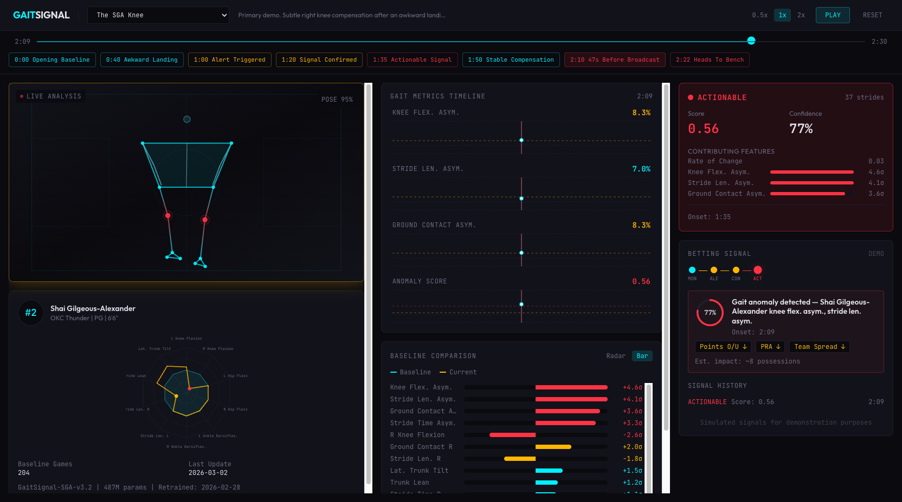
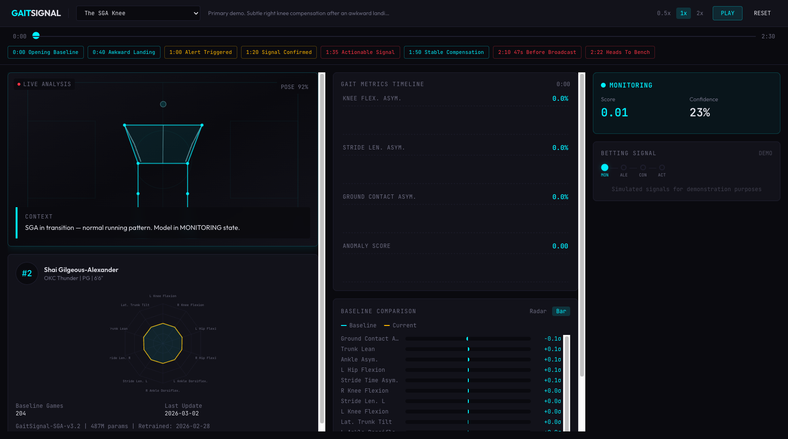
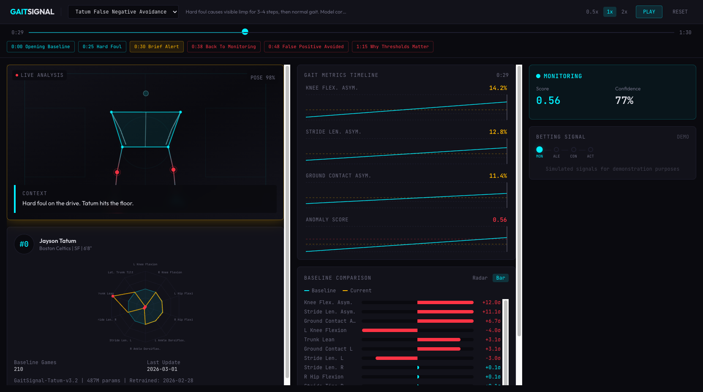

# GaitSignal

> Per-player biomechanical anomaly detection from arena pose estimation cameras — gradient-surprise scoring against individually-trained gait models, targeting 30fps inference on commodity hardware.

**Status: Idea stage.** This repository is a concept demo — an interactive React app with synthetic data that visualizes what a production GaitSignal system would look like. There is no trained model, no real inference, and no live pose estimation. The demo runs pre-computed gait data through a statistical anomaly scorer to demonstrate the detection logic, state machine, and signal output.

This is the sister project to [Acoustic Momentum](https://github.com/dmontgomery40/acoustic-momentum), which *is* a working model — real audio inference, real crowd noise analysis, real signal generation. GaitSignal takes the opposite approach: start with the idea, the architecture, and the research basis, and build a demo that shows exactly what the production system would do, before writing any of the ML pipeline. The production architecture described below is a detailed proposal grounded in 2026 research, not an implementation.



Arena cameras already see every player on the court. This project turns that footage into a **Gait Anomaly Index** — a continuous [0,1] signal per player that fires when their movement deviates from their own learned baseline, detected via gradient-norm surprise in a player-specific model trained on thousands of games of that player's gait alone.

## What It Is (and Isn't)

**What it is:** A concept and interactive demo for a real-time biomechanical deviation detector. The idea: each player gets their own ~70M parameter model that knows nothing except how *that player* moves. When the model is surprised by what it sees — quantified by gradient norm deviation and embedding-space perplexity — that surprise *is* the signal.

**What it isn't:** An injury classifier. GaitSignal doesn't diagnose — it detects *change*. A player whose right knee flexion asymmetry jumps from 3% to 7% in thirty seconds produces a strong signal regardless of cause. The downstream interpretation (injury, fatigue, tactical adjustment) is a separate problem.

**What makes it technically interesting:**

1. **One model per player, retrained weekly** — Jokic's model has never seen SGA's gait. Each model's entire learned manifold is one player's movement across thousands of possessions. This eliminates cross-player false positives entirely — 7% knee asymmetry is normal for one player and alarming for another, and each model knows which.

2. **Players with chronic conditions don't pollute the signal** — a player who has played through a nagging hamstring for six weeks? That compensation pattern is baked into their model as baseline. Their "normal" *includes* that adaptation. GaitSignal fires on *change from their own normal*, not deviation from some universal biomechanical template.

3. **Gradient-norm anomaly scoring, not threshold comparison** — in production, the signal isn't "knee angle > X degrees." It's: how hard does this frame's gait vector pull on the model's gradient normalization? How far into the tail of the model's embedding space does this input land? Essentially — perplexity and delta from gradient norms. A well-trained player model produces near-zero gradients on normal gait. When gradients spike, the model is seeing something it hasn't learned.

4. **Complementary to tracking data** — optical tracking tells you WHERE a player is moving. GaitSignal tells you HOW they're moving at the biomechanical level. These are orthogonal signals. Combined with crowd acoustics (see [Acoustic Momentum](https://github.com/dmontgomery40/acoustic-momentum)), they form a multi-modal detection platform where each channel sees something the others miss.

## Architecture

### Demo (This Repository)

The demo runs pre-computed synthetic gait data through the full UI pipeline — no live inference, no cameras. It demonstrates the detection logic, state machine, and signal output at 30fps in the browser.

```
Pre-computed gait data (synthetic, biomechanically plausible)
        │
        ▼
┌─────────────────────────────────────────┐
│  20-Dimensional Gait Feature Vector     │
│  Joint angles · stride lengths ·        │
│  ground contact · trunk lean · symmetry │
│  per-frame at 30 Hz                     │
└────────────────┬────────────────────────┘
                 │
                 ▼
┌─────────────────────────────────────────┐
│  Anomaly Scorer                         │
│  Rolling z-scores vs player baseline    │
│  Rate-of-change detection               │
│  4-state machine: MON → ALT → CON → ACT│
│  5-stride confirmation requirement      │
└────────────────┬────────────────────────┘
                 │
                 ▼
┌─────────────────────────────────────────┐
│  Dashboard UI                           │
│  Skeleton overlay · sparkline charts    │
│  Narrative overlays · betting signals   │
│  React + Vite + Tailwind + D3           │
└─────────────────────────────────────────┘
```

### Production Architecture (Proposed — Not Implemented)

The production system would replace synthetic data with live pose estimation and replace z-score thresholds with gradient-surprise scoring against per-player SSM models. Everything below is a research-grounded design proposal, not working code.

```
Arena cameras (4–8 per court, existing infrastructure)
        │
        ▼  multi-view triangulation
┌─────────────────────────────────────────┐
│  Pose Estimation — shared model         │
│  SasMamba-derived SSM (structure-aware   │
│  stride state space model)              │
│  ~5M params · <5ms/frame · 33 keypoints │
│  Linear complexity, not quadratic       │
└────────────────┬────────────────────────┘
                 │  (batch, frames, 33, 3)
                 ▼
┌─────────────────────────────────────────┐
│  Gait Feature Extraction                │
│  Joint angles, stride lengths, ground   │
│  contact times, trunk dynamics          │
│  → 20-dim feature vector per frame      │
│  Kalman-smoothed, confidence-filtered   │
└────────────────┬────────────────────────┘
                 │  (batch, frames, 20)
                 ▼
┌─────────────────────────────────────────┐
│  Per-Player Anomaly SSM  [×N players]   │
│  MS-SSM backbone (multi-scale SSM)      │
│  ~65M params per player                 │
│  Dual-resolution: stride-level (high-f) │
│    + game-arc (low-f) simultaneously    │
│  ALoRa-T attention head (low-rank)      │
│    for feature-level localization       │
│  Engram-style conditional memory        │
│    (game context gating — see below)    │
│  Trained on ~2,000 games of ONE player  │
│  Retrained weekly on fresh game footage │
└────────────────┬────────────────────────┘
                 │
                 ▼
┌─────────────────────────────────────────┐
│  Gradient-Surprise Scorer               │
│  Autoregressive next-frame prediction   │
│  Backprop prediction loss per frame     │
│  Score = f(gradient L2 norm,            │
│            embedding perplexity,        │
│            feature-wise ALoRa-Loc)      │
│  → Gait Anomaly Index [0, 1]           │
│  Confirmation: 5+ consecutive strides   │
│    above learned surprise threshold     │
└────────────────┬────────────────────────┘
                 │
                 ▼
        Betting signal emission
        Market impact estimates
        ~70M params total per player
        30 fps · <15ms end-to-end
```

## The 20-Element Gait Feature Vector

This is the contract between pose estimation and anomaly detection. Order matters — each model's learned manifold is shaped by this exact feature layout.

| # | Feature | Unit | Typical Range |
|---|---------|------|---------------|
| 1 | Left knee flexion peak | degrees | 30–55 |
| 2 | Right knee flexion peak | degrees | 30–55 |
| 3 | Knee flexion asymmetry | % | 0–12 |
| 4 | Left hip flexion peak | degrees | 25–45 |
| 5 | Right hip flexion peak | degrees | 25–45 |
| 6 | Hip flexion asymmetry | % | 0–10 |
| 7 | Left ankle dorsiflexion peak | degrees | 10–25 |
| 8 | Right ankle dorsiflexion peak | degrees | 10–25 |
| 9 | Ankle asymmetry | % | 0–8 |
| 10 | Stride length left | normalized | 0.8–1.3 |
| 11 | Stride length right | normalized | 0.8–1.3 |
| 12 | Stride length asymmetry | % | 0–6 |
| 13 | Stride time left | ms | 350–500 |
| 14 | Stride time right | ms | 350–500 |
| 15 | Stride time asymmetry | % | 0–5 |
| 16 | Ground contact time left | ms | 180–280 |
| 17 | Ground contact time right | ms | 180–280 |
| 18 | Ground contact asymmetry | % | 0–8 |
| 19 | Trunk lean | degrees | -5–10 |
| 20 | Lateral trunk tilt | degrees | -8–8 |

Stride frequency during basketball running: 1.2–1.5 Hz. Healthy stride asymmetry: <4%. Compensation-indicator asymmetry: >8%. Anomaly onset follows a sigmoid ramp over 10–15 seconds, not a step function.

## Why Gradient Norms, Not Thresholds

The demo uses rolling z-scores against a statistical baseline. That works for a demo. In production, the signal source is fundamentally different.

A per-player SSM is trained autoregressively — given frames 1...t, predict frame t+1's gait vector. On normal gait, the model predicts accurately. Loss is low. Gradients are small. The model's parameters barely need to update.

When the player's gait deviates from their learned manifold — a subtle knee compensation, an asymmetry shift, shortened ground contact — the model's predictions diverge from reality. Loss spikes. Gradients spike. The magnitude of that gradient spike, measured as the L2 norm across model parameters, *is* the anomaly score.

The advantage over threshold-based detection: gradient norms capture *multi-dimensional* deviation simultaneously. A player might show 2% more knee asymmetry, 5ms longer ground contact on the left, and 1.5 degrees more trunk lean — each individually sub-threshold, but collectively producing a large gradient norm because the *combination* is unprecedented in the model's training data. The model's embedding space encodes feature correlations that simple per-feature thresholds miss.

## Engram as a Context Hyperparameter

DeepSeek's Engram architecture (Cheng et al., January 2026, arXiv 2601.07372) introduces conditional memory via scalable lookup — O(1) retrieval from arbitrarily large memory tables, gated by current hidden state so that irrelevant retrievals are suppressed.

In GaitSignal's production architecture, Engram-style conditional memory serves as a **context-aware gating layer** on the per-player model:

- **Memory table**: Stores game-context embeddings — home/away, minutes played, back-to-back schedule, quarter, score differential, recent substitution patterns. Each context condition maps to a learned modulation of what "normal" means for that player.

- **Context-aware gating**: A player's gait on minute 38 of a back-to-back road game is legitimately different from minute 2 of a home opener. The Engram gate modulates the anomaly threshold so that expected fatigue patterns in fatiguing contexts don't produce false positives.

- **O(1) lookup**: Game context doesn't change frame-to-frame. The Engram lookup fires once per possession change, not per frame, adding negligible compute overhead.

The key compatibility: Engram's multi-head hashing and gating mechanism operates on hidden states, making it architecture-agnostic. It slots into the MS-SSM backbone between the temporal encoder and the gradient-surprise scorer as a conditioning layer, not a replacement for any existing component.

## Model Training Pipeline

### Per-Player Model Lifecycle

```
Historical game footage (2,000+ games per player)
        │
        ▼  SasMamba pose extraction (batch, offline)
┌─────────────────────────────────────────┐
│  Gait Feature Archive                   │
│  20-dim vectors × 30fps × ~40 min/game  │
│  ≈ 144M feature frames per player       │
│  Stored as memory-mapped float16 arrays │
└────────────────┬────────────────────────┘
                 │
                 ▼
┌─────────────────────────────────────────┐
│  Weekly Training Job                    │
│  MS-SSM autoregressive pretraining      │
│  + ALoRa-T anomaly head fine-tuning     │
│  + Engram context table update          │
│  ~65M params · ~4 hours on single A100  │
│  Knowledge distillation from larger     │
│    ensemble for regularization          │
└────────────────┬────────────────────────┘
                 │
                 ▼
┌─────────────────────────────────────────┐
│  Validation                             │
│  Holdout games with known injury events │
│  Gradient-norm calibration              │
│  False positive rate targeting (<2/game)│
└────────────────┬────────────────────────┘
                 │
                 ▼
        Deploy to arena edge device
        Model swap is atomic (no downtime)
```

### Why Weekly Retraining Matters

Players adapt. A center who tweaks their post footwork over the off-season now has a different baseline. A guard recovering from ankle surgery gradually returns to full mechanics over 8 weeks — each week, their "normal" shifts.

Weekly retraining means the model's learned manifold tracks the player's actual current movement patterns. The window is long enough to build statistical power (~3 games/week during the season) and short enough to capture genuine adaptation.

**Critically: injury games are not excluded from training data.** If a player plays through a minor quad strain for three weeks, those games become part of their baseline. Their compensated gait IS their gait during that period. The signal fires on the *transition* — the game where the compensation first appears, or the game where it suddenly worsens. Steady-state adaptation, even if biomechanically suboptimal, is just how that player moves now.

## Key Research References (2026)

| Paper | Venue | Relevance |
|-------|-------|-----------|
| **SasMamba**: Structure-Aware Stride SSM for 3D Pose (Cui et al.) | WACV 2026 | 0.64M param pose estimation with linear complexity. Proves SSMs replace transformers for real-time skeletal tracking. |
| **Pose3DM**: Bidirectional Mamba for Clinical Gait Analysis | Fractal & Fractional 2025 | 82% fewer params than MotionBERT. Explicitly validated on clinical gait patterns. |
| **MS-SSM**: Multi-Scale State Space Model (Karami et al.) | arXiv Dec 2025 | Dual-resolution processing captures stride-level and game-arc patterns simultaneously. |
| **ALoRa-T**: Low-Rank Transformer for Time Series Anomaly (Shimillas et al.) | arXiv Feb 2026 | Low-rank attention reduces compute on multivariate time series. ALoRa-Loc localizes anomalies to specific features. |
| **Engram**: Conditional Memory via Scalable Lookup (Cheng et al., DeepSeek) | arXiv Jan 2026 | O(1) context retrieval with gating. Adapted here for game-context modulation of anomaly thresholds. |
| **PoseShot**: CNN-BiLSTM-Transformer for Basketball Pose (Scientific Reports) | Sci. Rep. Mar 2026 | Basketball-specific pose analysis. Validates hybrid temporal architectures for sport biomechanics. |
| **GameSense**: Hierarchical Spatio-Temporal Transformer (Scientific Reports) | Sci. Rep. 2025 | End-to-end basketball tracking + action analysis with hierarchical temporal memory. |

## Demo Scenarios

Three scenarios demonstrate the detection pipeline with pre-computed synthetic data:

### 1. "The SGA Knee" (Primary)

Shai Gilgeous-Alexander in transition. Subtle right knee compensation after an awkward landing. Model catches the gait shift 47 seconds before the broadcast camera catches SGA grimacing on the bench. Full state machine progression: monitoring → alert → confirmed → actionable. Betting signals fire across player points, team spread, and player rebounds+assists.

| Baseline (monitoring) | Anomaly detected (actionable) |
|---|---|
|  |  |

### 2. "Jokic Fatigue Drift"

Nikola Jokic on a back-to-back. Gradual fatigue-induced gait degradation — stride length shortening, ground contact time increasing over 15 minutes. Lower-confidence signal but still actionable for over/under markets.

### 3. "Tatum False Positive Avoidance"

Jayson Tatum takes a hard foul. Three steps of visible limp. Alert triggers immediately — but only three strides above threshold. The model requires five consecutive strides before confirming. Three strides later, he's running normally. Alert dismissed. No false signal reaches the trading desk.



This scenario demonstrates engineering maturity: knowing when *not* to fire is as important as knowing when to fire.

## Quick Start

```bash
cd ~/GaitSignal

# install deps
npm install

# start dev server
npm run dev

# production build
npm run build

# typecheck
npx tsc --noEmit
```

Open `http://localhost:5173`. Select a scenario. Press PLAY.

## Stack

- TypeScript + React (Vite)
- Tailwind CSS (dark theme, utility classes only)
- Recharts (time-series sparklines)
- D3 (radar charts, skeleton overlay)
- MediaPipe Pose via `@mediapipe/tasks-vision` (in-browser inference path)
- No backend. Fully client-side. Static build output.

## Where This Signal Is Useful

**NBA and top-flight basketball** already have extensive camera infrastructure. SportVU and Second Spectrum track player positions at 25fps in every NBA arena. The cameras are there. The pose estimation models to extract biomechanics from that footage are reaching real-time capability (SasMamba, Pose3DM). The missing piece is the per-player anomaly detection layer — and the gradient-surprise scoring approach makes that feasible at scale.

**In-play betting markets** are the primary application. A 47-second advance signal on a star player's physical state — before the broadcast shows anything, before the player self-reports, before the coach makes a substitution — is a significant edge in markets that reprice continuously.

**Player health monitoring** is the secondary application. The same system, with different downstream logic, could alert medical staff to developing compensations before they become injuries. Zone7 and Kitman Labs have demonstrated 60–72% injury prediction accuracy with tracking data alone; adding biomechanical gait features should improve that substantially.

## What This Demonstrates (Portfolio Context)

[Acoustic Momentum](https://github.com/dmontgomery40/acoustic-momentum) is a working model — real audio inference, real crowd noise analysis, real signal generation. GaitSignal is the other half of the same thesis: that the future of in-play analytics is multi-modal. This project demonstrates the *idea* side — what a second signal channel would look like, why it works, and how it would be built — while Acoustic Momentum demonstrates the *execution* side.

Together they show:

1. **Novel signal identification** — biomechanical gait deviation as an in-play pricing signal, complementary to tracking data and crowd acoustics
2. **Per-player personalization at scale** — individual models that capture what's normal for each player, eliminating cross-player false positives
3. **Gradient-based anomaly scoring** — gradient-norm surprise as an anomaly signal, not just statistical thresholds
4. **Multi-modal platform thinking** — GaitSignal + Acoustic Momentum = two orthogonal signal channels, each seeing something the other misses. Crowd noise captures collective human perception. Gait analysis captures individual biomechanical reality. The intersection is where the edge lives.
5. **Engineering maturity** — the false positive avoidance scenario (Tatum) demonstrates that a good system knows when NOT to fire, which is harder than knowing when to fire
6. **Current research fluency** — architecture decisions grounded in January–March 2026 publications (SasMamba, Engram, ALoRa-T, MS-SSM), not legacy approaches

## Extension Ideas

- **Multi-camera triangulation** — fuse 4–8 arena camera angles for occlusion-robust 3D pose, building on TrackID3x3 benchmarks (ACM MMSports 2025)
- **Fatigue accumulation model** — track game-arc gait degradation across quarters for over/under market signals
- **Cross-sport transfer** — soccer (hamstring compensations in sprint), tennis (serve mechanics degradation), American football (lineman stance asymmetry)
- **Explainability layer** — SHAP attribution on the 20-element feature vector to identify which specific biomechanical features are driving the anomaly score
- **Ensemble distillation** — train a larger ensemble model per player, distill into the 65M production model for regularization
- **Acoustic + biomechanical fusion** — when crowd noise spikes AND a player's gait anomaly index rises simultaneously, the combined signal confidence should be multiplicative
